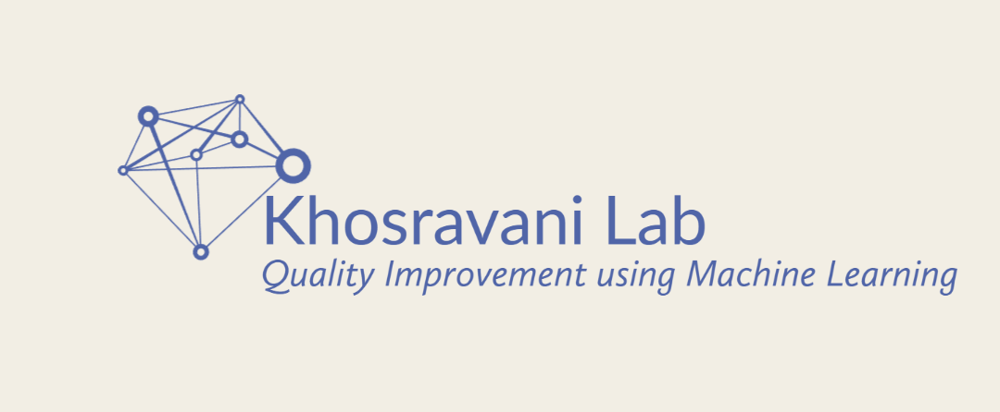
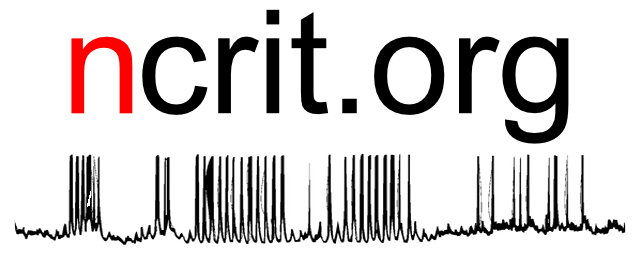

<!--  -->

Dr. Khosravani's Lab is centered on Quality Improvement (QI) in acute stroke care, resuscitation, and simulation. We are based out of the Division of Neurology at the University of Toronto. The lab focuses on the implementation of crisis resource management and stroke simulation to improve "door-to-needle" times and other door-to-intervention metrics. The work is aimed at enhancing care pathways and human performance factors for acute stroke patients through simulation. The lab also leverages machine learning for QI in addition to how it applies to not only acute stroke but also palliative care in the context of stroke. We passionate about providing maximal effective care, and that includes appropriate and compassionate palliative care. Therefore a portion of our work also focuses on the intersection of palliative medicine and stroke care because despite the major advnaces in stroke care a high proportion of patients still are left with significant morbidity and mortality.

The lab is actively involved in medical education, featuring a podcast called StrokeFM. This podcast is dedicated to disseminating knowledge about stroke care, using multimedia and web-based technologies.

The lab is also engaged in cutting-edge research in machine learning, where they leverage bedside physiologic recordings to enhance acute stroke care quality. This work is carried out in affiliation with T-CAIREM and SHSC.

Our lab has founded and is involved in several initiatves including NQIL (the Neurology Quality and Innovations Lab), along with Drs. Sara Mitchell and Charles Kassardjian, the Stroke FM Podcast, which is the official podcast of the Canadian Stroke Consortium, and SiLab (Simulation Lab), which is focused on all things resuscitation. Dr. Khosravani and Dr. Christine Hawkes co-founded the Neurovascular Innovations CollaborativE (NICE) - it is anticipated that NICE will contribute significantly to a joint mission of leveling-up education in neurovascular care.

Our lab has coined the term "neurovascular resuscitation" translating concepts from medical and trauma resusciation to stroke.

Disclaimer: Links, topics, and posts discussed on this site are for educational purposes only, there is no duty of care and not for medical advice or expert consultation. The site reflects personal opinions, and do not reflect or replace expert advice or the institution, place or work, or any other organization. Please get in touch if interested in machine learning, QI, human factors, and simulation, and collaborating on any stroke/neurovascular or neurocritical care initiatives.