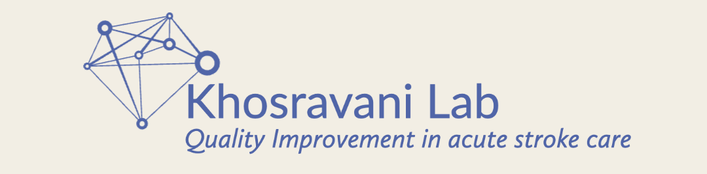
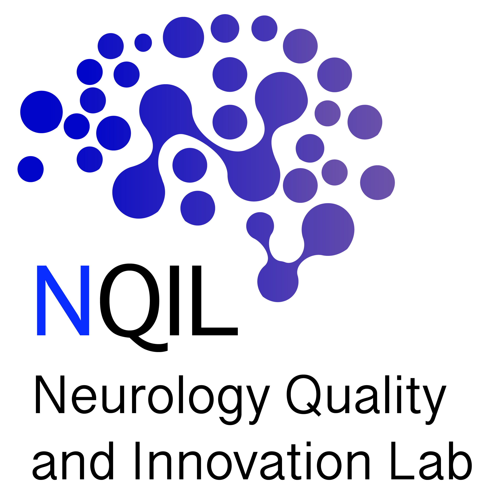

<!--  -->

**About**

Welcome to the **Stroke Innovation Lab (#AI4QI) (#ML4QI)**. We focus on the discipline of clinical neurology with a focus on neurovascular care. Our Quality Improvement (QI) lab for stroke care leverages machine learning as applied to datasets and time-series data in stroke care.

Lab PI: Dr. Houman Khosravani, Division of Neurology at the University of Toronto.

Our lab's QI foci are the following:

* **Stroke Resuscitation and Simulation** - our lab termed the work "stroke resuscitation", developed the protected code stroke protocol, defined the use of crisis resource management in stroke, and thus our focus is education and quality improvement during the code stroke process. We use CRM principles and have an active code stroke simulation program. This also includes our efforts within NICE (Neurovascular Innovations CollaborativE) as listed below.
* **AI4QI - ML4QI** - machine learning for bolstering current standards of care. We are leveraging machine-learning to enhance QI within acute stroke care in the inpatient setting. Our current work is focused on using voice as a biomarker - we call this Sonic Diagnosis.
* **Palliative Care in Acute Stroke** - we are passionate about providing maximal effective care and that includes integration of palliative care within stroke treatment; our lab works on the development of protocols for routine integration of palliative care as we define the scope of palliative medicine in acute stroke care.

Members of the lab are also involved in educational initiatives, including a podcast on stroke education: Stroke FM Podcast, the official podcast of the Canadian Stroke Consortium.

**Neurovascular Resuscitation**
* Our lab championed the framework of crisis resource management in stroke simulation to optimize critical intervention metrics such as "door-to-needle" times. We are proud to be pioneers in the field and we published the first reframe of Crisis Resource Management (CRM) for stroke care care. We also developed the "protected code stroke" during the COVID19 pandemic, which was integrated into national and international guidelines, and downloaded over 30,000 times from the American Heart Association, Stroke journal's website. Our research aims to enhance care pathways and human performance factors for acute stroke patients through simulation of neurovascular resuscitation. We have introduced the concept of "neurovascular resuscitation," applying principles from medical and trauma resuscitation to stroke treatment - thereby reinstating the 'code' in code stroke.
* In 2023, Dr. Houman Khosravani and Dr. Christine Hawkes co-founded the Neurovascular Innovations CollaborativE (NICE), an initiative projected to contribute substantially to augmenting neurovascular care education.
* Our lab's portion of focus is the medical/neurocritical care efforts within NICE, while Dr. Hawkes helms the neurovascular and catheter-based aspects of hyperacute care and techniques.

* We are also proud to have hosted the 🇨🇦 Canada's First Stroke Resuscitation Course (SRC) in Toronto, Canada on April 18, 2024. and SRC TO FU (Follow-Up) on January 17, 2025.
    * @uoftneurons @UofTNeurologyPD @UofTNeurology @uoftmedicine On January 17, 2025, we @neuroccm @CMHawkes Dr. Martin Chapman,  had the privilege again to host @uoftneurons for "SRC T.O. FU" (Follow-Up) - another 🇨🇦 Canada First: a day of superb learning with an innovative curriculum for Neurology residents - focusing on the use of POCUS (point-of-care ultrasound) for assessment of hyperacute stroke, in addition to using ocular ultrasound for optic nerve sheath diameter (limited surrogate for ICP), and also pupillary response (with closed-shut) eyes. We also covered carotid imaging, basic abdominal imaging, and use of POCUS for LP.

    * "SRC T.O. FU" - Stroke Resuscitation Course Toronto Follow-Up
        Co-Facilitators Drs. Khosravani, Hawkes, Chapman
        Program:
        Phase 1 - Breakfast + Introduction to Point-of-care stroke US in Acute Stroke - Point-of-Care ECHO in Hyperacute Stroke - saving lives by taking a look
        Phase 2 - US session; POCUS; basic cardiac for stroke, Optic nerve sheath; diameter, Vascular Access, Carotid Imaging, use of POCUS for LP, Sunnybrook Canadian Simulation
        Phase 3 - (working lunch) EVT Complications & Considerations
        12:00-12:30 - (continue lunch) Lunch, Discussion, and adjourn
    * <blockquote class="twitter-tweet">
...
&mdash; ... <a href="https://twitter.com/neuroccm/status/1881546029599739970">...</a></blockquote> 

**[ML4QI](https://uoftneurology.github.io) - Artificial Intelligence 4 Quality Improvement and the Neurology Quality and Innovations Lab [NQIL](https://sites.google.com/nqil.ca/nqil/)**
* We are also exploring the intersection of machine learning and quality improvement, utilizing voice-based technologies to refine our methods. We have expertise in deep-learning and processing of audio signals.
* <blockquote class="twitter-tweet">
...
&mdash; ... <a href="https://twitter.com/neuroccm/status/1806704940183597195">...</a></blockquote> 
* Our pursuit of excellence extends to the cutting-edge field of machine learning. With support from T-CAIREM and SHSC, we are leveraging bedside physiologic recordings to improve the quality of acute stroke care.
* We are proud to have founded several initiatives, including the Neurology Quality and Innovations Lab (NQIL), in collaboration with Drs. Sara Mitchell and Charles Kassardjian.

**Routine Integration of Palliative Care in Stroke**
* Despite significant advancements in stroke care, a considerable number of patients still grapple with substantial morbidity and mortality. Recognizing this, we advocate for the routine integration of palliative care into stroke treatment. Compassionate and effective care forms the bedrock of the philosophy we advocate for in terms of expanding the confluence of palliative medicine and stroke care.

Members of the lab also are involved in educational initiatives, a podcast on stroke education: Stroke FM Podcast, the official podcast of the Canadian Stroke Consortium.

If you are a student with an interest in QI and experienced in research, or if you are an engineering or CS or MD student interested in clinical applications of machine learning in neurology please reach out. [Get in touch](https://docs.google.com/forms/d/e/1FAIpQLSf9cr_X83Y9LKizY-xQ5ipav-r99H8RRPf_8c4Xh9E5XnIJkQ/viewform?usp=sharing) or send an email (houman[at]neurovascular[dot]ca), if you are interested in collaborating on any of the above topics: machine learning, QI, human factors, and simulation in the realms of stroke/neurovascular or neurocritical care initiatives. 

Please note: All content on this site, including blogs, links, topics, and posts, is intended solely for educational purposes. This site does not constitute medical advice or consultation and does not establish a duty of care or any medical care/information/advice/or other obligations. Opinions expressed here are personal and do not reflect or replace expert advice from any institution, workplace, or organization. By using the site you agree to this.

* <a rel="me" href="https://sigmoid.social/@neuroccm">neuroccm@sigmoid.social</a>
* <a rel="me" href="https://bsky.app/profile/neuroccm.bsky.social">neuroccm.bsky.social</a>

<!--  -->